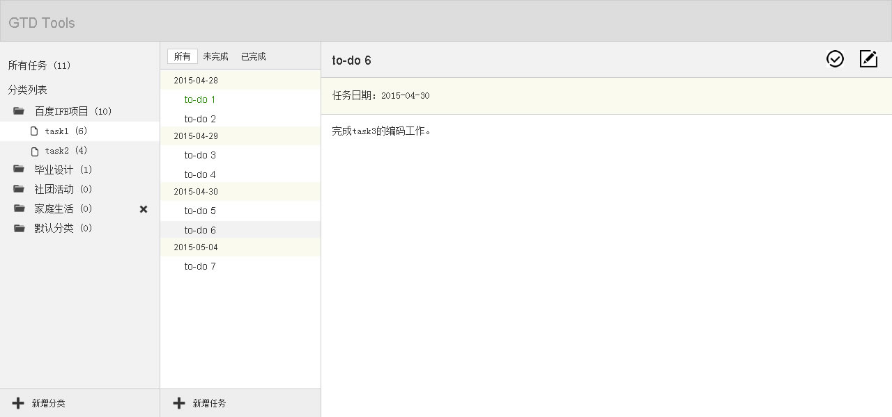

# 综合大练习

**任务编号**：`TASK 0003`

## 任务目的

结合前两个任务所掌握的HTML、CSS、JavaScript知识，实现一个中等复杂度的Web网站实现

## 任务时间

- 初级班：**10**天
- 中级班：**10**天

## JavaScript深度学习

### 任务描述

深度学习JavaScript，仔细掌握作用域、原型、闭包等概念，掌握一些基本的设计模式，为后续的大作业打下基础。

完成以下内容的学习笔记撰写，推荐发到自己的博客或Github上。

* JavaScript作用域学习笔记
* JavaScript原型学习笔记
* JavaScript闭包学习笔记
* JavaScript构造函数学习笔记
* JavaScript面向对象编程学习笔记
* JavaScript设计模式学习笔记

### 参考资料

* [鸟哥：Javascript作用域原理](http://www.laruence.com/2009/05/28/863.html)
* [理解 JavaScript 作用域和作用域链](http://www.cnblogs.com/lhb25/archive/2011/09/06/javascript-scope-chain.html)
* [强大的原型和原型链](http://www.nowamagic.net/librarys/veda/detail/1648)
* [js原型链原理看图说明](http://www.jb51.net/article/30750.htm)
* [理解JavaScript原型](http://blog.jobbole.com/9648/)
* [深入理解javascript原型和闭包](http://www.cnblogs.com/wangfupeng1988/p/3977987.html)
* [学习Javascript闭包](http://www.ruanyifeng.com/blog/2009/08/learning_javascript_closures.html)
* [javascript的闭包](http://www.cnblogs.com/rubylouvre/archive/2009/07/24/1530074.html)
* [JavaScript 闭包深入理解](http://www.jb51.net/article/18303.htm)
* [理解 Javascript 的闭包](http://www.oschina.net/question/28_41112)
* [Javascript 面向对象编程](http://www.ruanyifeng.com/blog/2010/05/object-oriented_javascript_encapsulation.html)
* [JavaScript继承详解](http://www.cnblogs.com/sanshi/archive/2009/07/08/1519036.html)
* [JavaScript继承方式详解](http://segmentfault.com/a/1190000002440502)
* [JavaScript探秘：构造函数 Constructor](http://www.nowamagic.net/librarys/veda/detail/1642)
* [理解Javascript constructor实现原理](http://www.jb51.net/article/25027.htm)
* [Javascript中this关键字详解](http://www.cnblogs.com/justany/archive/2012/11/01/the_keyword_this_in_javascript.html)
* [Javascript的this用法](http://www.ruanyifeng.com/blog/2010/04/using_this_keyword_in_javascript.html)
* [深入浅出 JavaScript 中的 this](http://www.ibm.com/developerworks/cn/web/1207_wangqf_jsthis/index.html)
* [JavaScript The Core](http://dmitrysoshnikov.com/ecmascript/javascript-the-core/)
* [Eloquent JavaScript](http://eloquentjavascript.net/)
* [JavaScript Garden](http://bonsaiden.github.io/JavaScript-Garden/)
* [JavaScript设计模式深入分析](http://developer.51cto.com/art/201109/288650.htm)
* [常用的Javascript设计模式](http://blog.jobbole.com/29454/)
* [Learning JavaScript Design Patterns](http://addyosmani.com/resources/essentialjsdesignpatterns/book/)
* [LS的中文版：学用 JavaScript 设计模式](http://www.oschina.net/translate/learning-javascript-design-patterns)

## 综合练习

### 任务描述

参考[设计稿](img/design.png)实现一个简单的个人任务管理系统：如下图

任务需求描述：

* 最左侧为任务分类列表，支持查看所有任务或者查看某个分类下的所有任务
    - 初始时有一个`默认分类`，进入页面时默认选中`默认分类`。
    - 分类支持多层级别。
    - 分类支持**增加**分类、**删除**分类两个操作
        - 在左侧分类最下方有添加操作，点击后弹出浮层让输入新分类的名称，新分类将会被添加到当前选中的分类下。浮层可以为自行设计实现，也可以直接使用`prompt`。
        - 当鼠标`hover`过某一个分类时，右侧会出现**删除按钮**，点击后，弹出确认是否删除的浮层，确认后删除掉该分类。弹出的确认浮层可以自行设计实现，也可以直接使用`confirm`。
        - 不能为`默认分类`添加子分类，也不能删除`默认分类`。
    * 每一个分类名字后显示一个当前分类下的未完成任务总数量。
* 中间列为任务列表，用于显示当前选中分类下的所有未完成任务
    - 任务列表按日期（升序或者降序，自行设定）进行聚类
    - 用不同的字体颜色或者图标来标示任务的状态，任务状态有两张：`已完成`或`未完成`。
    - 下方显示`新增任务`的按钮，点击后，右侧列会变成新增任务编辑界面。
    - 单击某个任务后，会在右侧显示该任务的详细信息。
    - 在任务列表的上方有任务筛选项，可以选择在任务列表中显示所有任务，或者只显示`已完成`或者`未完成`的任务。
* 右侧为任务详细描述部分
    - 第一行显示任务标题，对于未完成的任务，在标题行的右侧会有`完成任务`的操作按钮及`编辑任务`的按钮。
    - 点击`完成任务`按钮时，弹出确认是否确认完成的浮层，确认后该任务完成，更新中间列任务的状态。弹出的确认浮层可以自行设计实现，也可以直接使用`confirm`。
    - 点击`编辑任务`操作后，右侧变更为编辑窗口。
* 新增及编辑任务窗口描述
    - 有3个输入框：分别是标题输入框，完成日期输入框及内容输入框
    - 标题输入框：输入标题，为单行，需要自行设定一个标题输入限制的规则（如字数），并给出良好提示。
    - 日期输入框：单行输入框，按照要求格式输入日期，如yyyy-mm-dd
    - 内容输入框：多行输入框，自行设定一个内容输入的限制（如字数），并给出良好提示。
    - 确认按钮：确认新增或修改。
    - 取消按钮：取消新增或修改。

任务实现要求：

* 整个界面的高度和宽度始终保持和浏览器窗口大小一致。当窗口变化高宽时，界面中的内容自适应变化。
* 左侧列表和中间列表保持一个固定宽度（自行设定），右侧自适应。
* 需要自行设定一个最小宽度和最小高度，当浏览器窗口小于最小值时，界面内容的高度和宽度不再跟随变化，允许浏览器出现滚动条。
* 通过本地存储来作为任务数据的保存方式。
* 不使用任何类库及框架。
* 尽可能符合[代码规范](https://github.com/ecomfe/spec)的要求。
* 浏览器兼容性要求：Chrome、IE8+。

**注意**

该设计稿仅为线框原型示意图，所有的视觉设计不需要严格按照示意图。如果有设计能力的同学，欢迎实现得更加美观，如果没有，也可以按照线框图实现。以下内容可以自行发挥：

* 背景颜色
* 字体大小、颜色、行高
* 线框粗细、颜色
* 图标、图片
* 高宽、内外边距

