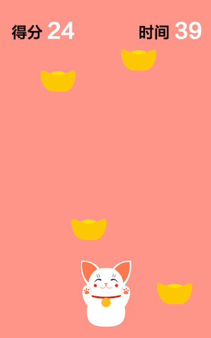
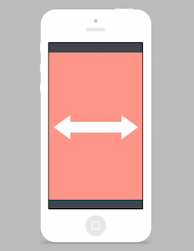

# 游戏扬帆班任务「接元宝」游戏说明

## 任务描述

实现一个移动端游戏，玩家通过触屏控制角色水平方向移动，接住从屏幕上方落下的元宝。记录玩家规定时间内接住的元宝个数作为一局的分数。

## 任务要求

## 任务时间

7月27日 至 8月9日

## 任务步骤

### 1. 技术选型

根据待开发游戏的类型和功能，从以下技术方案中挑选**一种**：

- Canvas (推荐)
    + **不使用游戏引擎**。参考资料：
        - [Canvas API](https://developer.mozilla.org/zh-CN/docs/Web/API/Canvas_API)
        - How to Make a Simple HTML5 Canvas Game [英文](http://www.lostdecadegames.com/how-to-make-a-simple-html5-canvas-game/) [中文](http://www.cnblogs.com/Wayou/p/how-to-make-a-simple-html5-canvas-game.html)
    + **使用游戏引擎**。推荐 [Phaser](http://phaser.io/) 或 [CreateJS](http://createjs.com/)。HTML5 各游戏引擎的特性比较及开发者评价，可参考[这里](https://html5gameengine.com/)以供选择。参考资料：
        - How to make a Flappy Bird in HTML5 [英文](http://www.gamedevacademy.org/how-to-make-a-flappy-bird-in-html5/) [中文](http://blog.jobbole.com/62203/)
        - [Phaser 速查表](http://invrse.co/phaser-cheatsheet/)
    
- DOM + CSS
    + 参考资料：
        - [HTML5游戏开发实战分享](http://oklai.name/html5game/)
        - [DOM + CSS3 实现小游戏 SwingCopters](http://www.cnblogs.com/lvdabao/p/3968464.html)

- 两者结合：用 Canvas 绘制主体元素和动画，用 DOM 制作 UI。

### 2. 一个适配移动端的游戏场景

选择一种在移动端上的屏幕适配方案：

- 方案一：固定宽高比，方便布置元素。

    
    
- 方案二：延伸至适应屏幕，原生既视感。

    

### 3. 一个可操控的角色

创建一个角色，实现一种操控方式：

- 方案一：触击屏幕的任意位置，角色向该位置的对应水平点移动。

    
    
- 方案二：触摸屏幕左半边，角色向左移动；触摸屏幕右半边，角色向右移动。

    

- 方案三：触摸角色，拖拽移动。
    
    

- 或者其它合理的触屏操控方案。

### 4. 元宝

- 实现元宝的随机掉落，包括起始水平位置的随机、时间点的随机。
- 元宝回收机制：
    + 即时创建，即时销毁。
    + 对于频繁创建和销毁的对象，也可利用[对象池](https://zh.wikipedia.org/wiki/%E5%AF%B9%E8%B1%A1%E6%B1%A0%E6%A8%A1%E5%BC%8F)进行内存优化，算法具体实现可参考 [JavaScript Object Pool](http://blog.sklambert.com/javascript-object-pool/)。

### 5. 碰撞检测

- 选择一个高效合理的检测方法，判定角色是否接住元宝（自行实现算法或利用已有库皆可）。
- 经过任务步骤4和5后，若游戏在移动端上的[帧率](https://zh.wikipedia.org/wiki/%E5%B8%A7%E7%8E%87)不在 50~60 fps 之间，建议进行优化使游戏运行流畅。

### 6. 游戏界面元素

游戏的核心玩法实现以后，陆续将界面元素及相应逻辑补充完整：

- 开始按钮：触发首局游戏的开始；
- 记分板：实时记录玩家一局的分数；
- 倒计时器：限定一局的可玩时间，实时刷新；
- 结束菜单：以浮层形式展现，拥有该局分数、最高分、重新开始等元素。

### 7. 扩展

想一想，怎样扩展可以使游戏更有趣呢？

比如：

- 掉炸弹：被砸中减分、减命或直接结束游戏；
- 增加无尽模式：不限定时间，直至被炸弹砸中或者命消耗完；
- 其它掉落物：或给予不同的分数，或改变角色的状态；
- 角色不同状态下的贴图变化，比如接到元宝、被炸弹砸中；
- 音效/音乐；
- 元宝掉落初始方向不规则，甚至引入物理引擎；
- 换个主题？接果子、接盘子、接妹子……任你想！
- ……

## 团队合作建议

- 动手前，先共同讨论和设计游戏的具体流程、玩法及细节；
- 队员分工可按组件（角色-元宝-界面元素-…），可按功能（适配-操控-回收机制-碰撞检测-…），也可按职能（主程-算法优化-设计-…）；
- 每个队员都需要有代码提交；
- 尝试进行组内的交叉 Code Review，尽量保证队伍内部代码风格一致。
