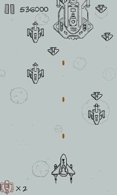
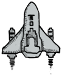

#游戏扬帆班任务二「打飞机」

## 任务描述

实现一个移动端游戏，玩家通过手机左右倾斜来控制飞机的水平移动，射击不断出现的敌机，并躲避敌机的冲击。

## 任务步骤

### 1. 技术选型

参见：[技术选型说明](https://github.com/baidu-ife/ife/blob/master/2015_summer/task/game_yangfan_01.md#1-技术选型)

### 2. 游戏状态设计

本游戏包含四个基本状态：

- 欢迎状态：包含欢迎信息、开始游戏按钮、选项设置等；
- 关卡状态：包含游戏的主体元素与核心玩法；
- 暂停状态：通过关卡状态的暂停按钮触发，包含回到游戏按钮、重新开始按钮；
- 结束状态：游戏关卡结束时触发，包含该局分数、最高记录、重新开始等元素；

### 3. 背景

- 利用「首尾相接」技巧，让一定高度的背景图片做反向循环滚动，造成主角向前行驶的视觉差；
- 可以在背景的基础上添加更多的图片层，以不同的速度滚动，形成远近层次的效果；

### 4. 主角

本游戏主角即为我方飞机，它在飞行时会以帧动画的形式显示，例如下图的两帧构成飞机喷气的效果：

可以增加更多帧使动画更加细腻流畅。

### 5. 子弹

- 初始位置：以所属飞机位置为基准；
- 飞行效果：一旦发射，垂直方向移动，水平方向不变；
- 回收机制：对于频繁创建和销毁的对象，可利用[对象池](https://zh.wikipedia.org/wiki/%E5%AF%B9%E8%B1%A1%E6%B1%A0%E6%A8%A1%E5%BC%8F)进行内存优化。

### 6. 操控

通过手机左右倾斜控制主角水平移动：

- 利用 HTML5 提供的重力感应特性实现；
- 可以考虑倾斜速率对主角移动速度的影响；
- 尽量适配移动端多设备多浏览器；
- 开发时可以使用 Chrome 的传感器模拟功能进行调试；

参考资料：

- [检测设备方向](https://developer.mozilla.org/zh-CN/docs/Web/API/Detecting_device_orientation)
- [使用 HTML5 设备方向检测特性开发的重力小游戏](http://www.gbtags.com/gb/share/4247.htm)

### 7. 敌机

- 至少有两种类型的敌机，各类型之间在贴图、生命值、移动速度、出现频率、击落奖励等方面有所不同；
- 随机初始位置和出现时间；
- 数量随分数增加而增加，或设置阶段性阈值；
- 选用合理的回收机制。

### 8. 碰撞检测

- 检测一：子弹与敌机的碰撞；
- 检测二：敌机与主角的碰撞；
- 主角、敌机的爆炸效果（帧动画或粒子效果）。

### 9. 暂停与屏蔽

暂停按钮触发暂停状态：

- 屏蔽重力感应，屏蔽关卡状态的可点击元素；
- 暂停主角、敌机、子弹的飞行，暂停背景滚动，暂停帧动画。

### 10. 收尾

- 关卡状态的其它界面元素，如记分板；
- 其余游戏状态，即欢迎状态和结束状态，以及对应的转场逻辑。

### 11. 扩展

想一想，怎样扩展可以使游戏更有趣呢？

比如：

- 天降各种类型的道具，如改变子弹类型的、全屏攻击的、短时间内无敌的，等等；
- 敌机也会发射子弹（考虑到操控的特殊性，应注意适当调试参数以控制游戏难度）；
- BOSS 战，引入人工智能；
- 子弹非自动发射，而是通过特定的操作；
- 音效/音乐；
- ……

## 任务时间

7月27日 至 8月14日

