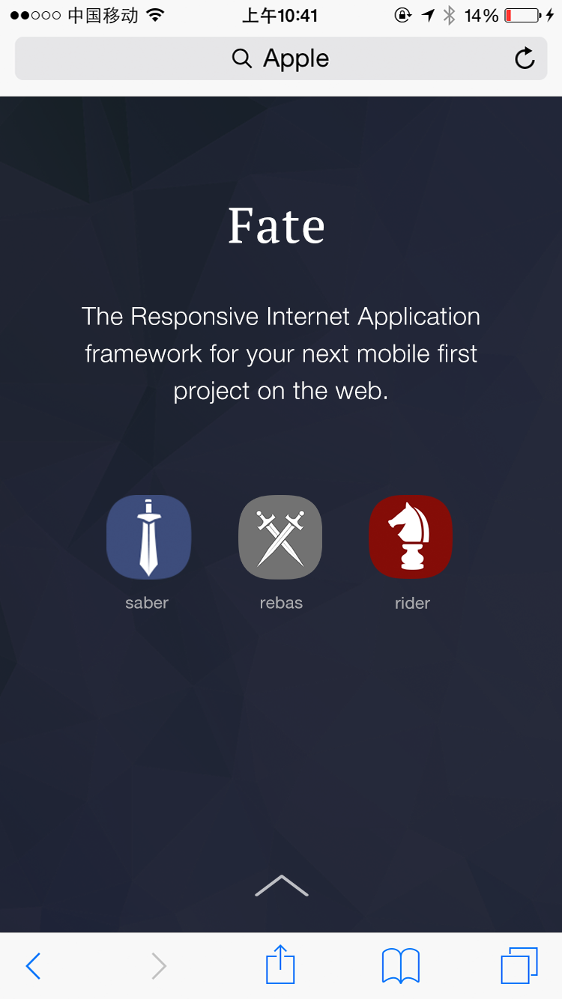
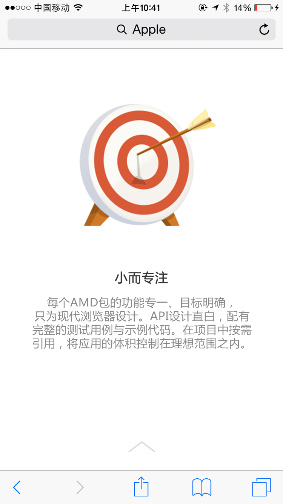
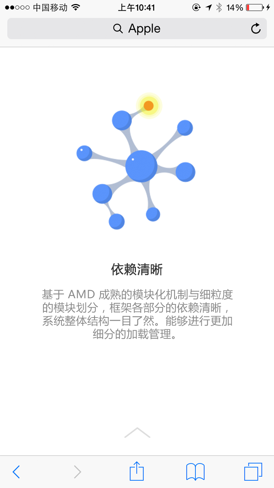
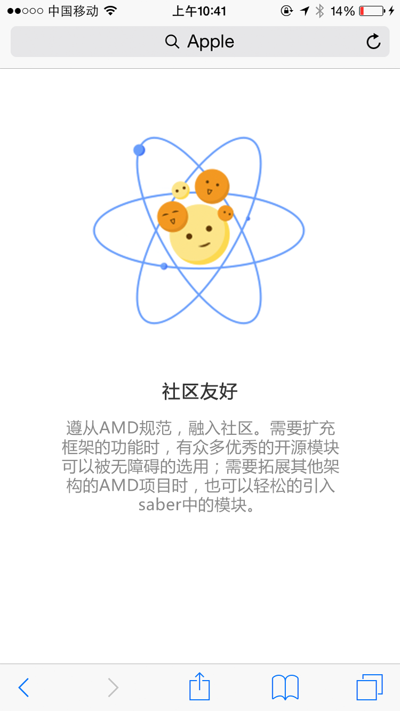

# 移动启航班任务-漂亮宣传手册

## 任务描述：

实现一个多页的个人（或其他）宣传页面，支持手指滑动翻页，有漂亮的动画效果

以上图仅作参考，大家可以随意按照自己的喜欢进行界面设计。

## 任务要求：

* 团队集体完成
* 支持手指滑动来翻页
* 有良好的动画效果
* 必须使用HTML、CSS、JavaScript编码进行完成，不可以使用所见即所得的在线编辑工具制作
* 允许使用基础的JS库，如Zepto，Hammer等
* 对于直接用Html5营销页面框架，我们不建议但不做强制限制

## 任务时间

7月27日 至 8月14日

## 学习资料

### HTML

- [知乎上的一些Web基本概念介绍](http://www.zhihu.com/question/22689579)
- [慕课网HTML+CSS基础课程](http://www.imooc.com/learn/9)
- [w3school html教程](http://w3school.com.cn/html/index.asp)
- [MDN HTML](https://developer.mozilla.org/zh-CN/docs/Web/HTML/Introduction)

### CSS

- [MDN CSS](https://developer.mozilla.org/zh-CN/docs/Web/Guide/CSS/Getting_started)
- [w3school css](http://w3school.com.cn/css/index.asp)
- [慕课网HTML+CSS基础课程](http://www.imooc.com/learn/9)

### JavaScript

- [MDN](https://developer.mozilla.org/zh-CN/docs/Web/JavaScript)
- [慕课网JavaScript入门](http://www.imooc.com/learn/36)
- [慕课网JavaScript教程](http://www.imooc.com/learn/10)
- [w3school](http://www.w3school.com.cn/js/)
- [Codecademy](http://www.codecademy.com/tracks/javascript)

### 移动

* [移动WEB开发入门](http://junmer.github.io/mobile-dev-get-started/)
* [移动开发资源集合](https://github.com/jtyjty99999/mobileTech)
* [The Mobile Web Handbook](http://quirksmode.org/mobilewebhandbook/)
* [MobileWeb 适配总结](http://www.w3ctech.com/topic/979)
* [移动前端不得不了解的html5 head 头标签](http://www.css88.com/archives/5480)
* [浅谈移动前端的最佳实践](http://www.cnblogs.com/yexiaochai/p/4219523.html)
* [touch系事件](http://www.html-js.com/article/All-right-thinking-touch-events)
* [移动端真机调试终极利器-BrowserSync](http://www.codingserf.com/index.php/2015/03/browsersync/)

