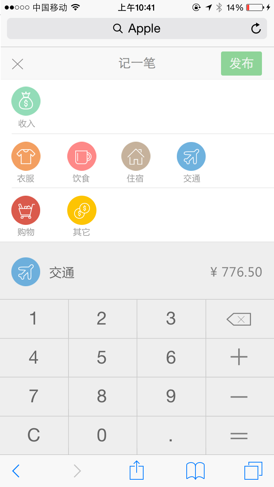

# 移动扬帆班任务一：个人记账本

## 任务描述：

实现一个在移动端浏览器访问的个人记账软件

以上图仅作参考，大家可以随意按照自己的喜欢进行界面设计。

## 任务要求：

* 团队协作完成
* 除了zepto或者类似的JS基础库、不允许使用任何框架
* 不需要登陆注册等功能
* 支持不同类型的账目记录
* 数据存储可以使用localStorage，可以不需要Server
* 如果需要使用Server端，不限制语言，但推荐nodejs，Server端框架使用不限制

## 任务时间

7月18日 至 7月26日

## 学习资料

* [春季班学习资料](https://github.com/baidu-ife/ife/tree/master/2015_spring/task/task0001)
* [春季班学习资料](https://github.com/baidu-ife/ife/tree/master/2015_spring/task/task0002)

### 移动

* [移动WEB开发入门](http://junmer.github.io/mobile-dev-get-started/)
* [移动开发资源集合](https://github.com/jtyjty99999/mobileTech)
* [The Mobile Web Handbook](http://quirksmode.org/mobilewebhandbook/)
* [MobileWeb 适配总结](http://www.w3ctech.com/topic/979)
* [移动前端不得不了解的html5 head 头标签](http://www.css88.com/archives/5480)
* [浅谈移动前端的最佳实践](http://www.cnblogs.com/yexiaochai/p/4219523.html)
* [touch系事件](http://www.html-js.com/article/All-right-thinking-touch-events)
* [移动端真机调试终极利器-BrowserSync](http://www.codingserf.com/index.php/2015/03/browsersync/)

