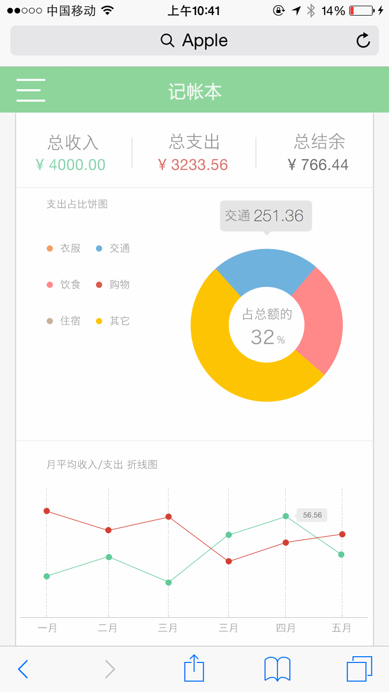

# 移动扬帆班任务二：个人记账本加强版

## 任务描述：

基于任务一，完善记账功能，增加统计图表功能

以上图仅作参考，大家可以随意按照自己的喜欢进行界面设计。

## 任务要求：

* 团队协作完成
* 进一步完善任务一的功能细节及用户体验
* 增加各种交互的动画效果
* 完整支持记账的增删改查功能
* 增加记账统计功能，可以按照多种维度进行账目统计（如收入/支出 类型，时间范围，月周粒度等）

## 任务时间

7月27日 至 8月14日

## 学习资料

* [春季班学习资料](https://github.com/baidu-ife/ife/tree/master/2015_spring/task/task0001)
* [春季班学习资料](https://github.com/baidu-ife/ife/tree/master/2015_spring/task/task0002)

### 移动

* [移动WEB开发入门](http://junmer.github.io/mobile-dev-get-started/)
* [移动开发资源集合](https://github.com/jtyjty99999/mobileTech)
* [The Mobile Web Handbook](http://quirksmode.org/mobilewebhandbook/)
* [MobileWeb 适配总结](http://www.w3ctech.com/topic/979)
* [移动前端不得不了解的html5 head 头标签](http://www.css88.com/archives/5480)
* [浅谈移动前端的最佳实践](http://www.cnblogs.com/yexiaochai/p/4219523.html)
* [touch系事件](http://www.html-js.com/article/All-right-thinking-touch-events)
* [移动端真机调试终极利器-BrowserSync](http://www.codingserf.com/index.php/2015/03/browsersync/)

