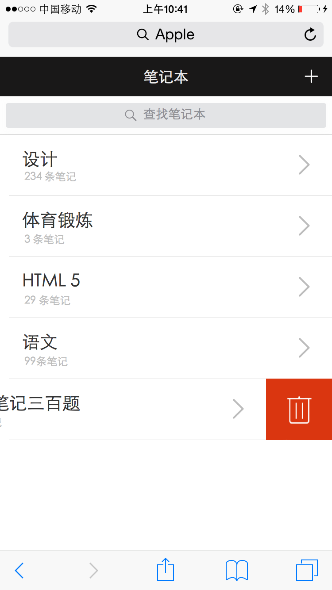
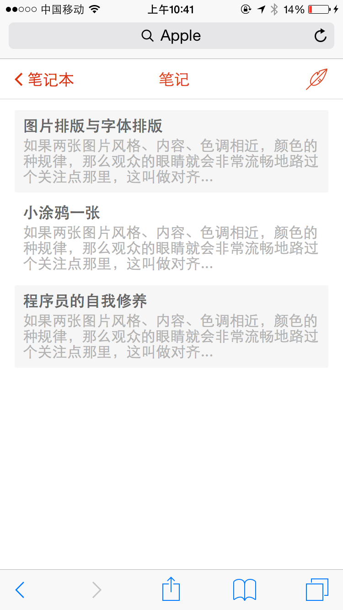
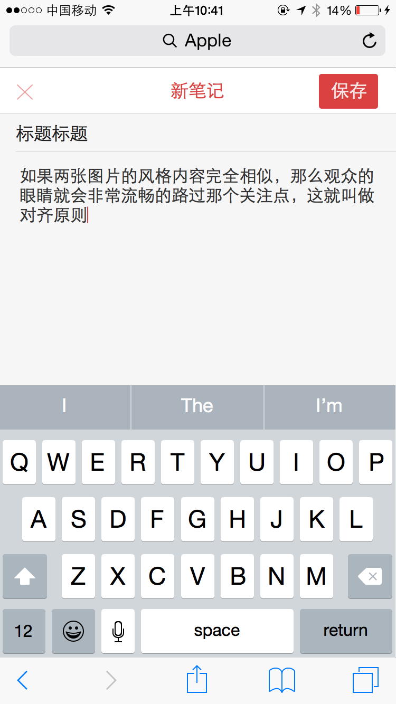
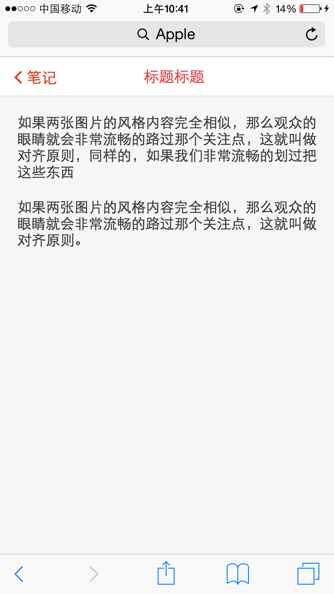

# RIA启航班任务二分支二：实现响应式支持的个人知识管理工具

## 任务描述：

基于任务一，实现一个支持响应式个人知识笔记管理网站

以上图仅作参考，大家可以随意按照自己的喜欢进行界面设计。

## 任务要求：

* 团队协作完成
* 完成对于移动设备的响应式支持
* 允许使用Zepto、Hammer等JS库

## 任务时间

7月27日 至 8月14日

## 学习资料

* [春季班学习资料](https://github.com/baidu-ife/ife/tree/master/2015_spring/task/task0001)
* [春季班学习资料](https://github.com/baidu-ife/ife/tree/master/2015_spring/task/task0002)

### 移动

* [移动WEB开发入门](http://junmer.github.io/mobile-dev-get-started/)
* [移动开发资源集合](https://github.com/jtyjty99999/mobileTech)
* [The Mobile Web Handbook](http://quirksmode.org/mobilewebhandbook/)
* [MobileWeb 适配总结](http://www.w3ctech.com/topic/979)
* [移动前端不得不了解的html5 head 头标签](http://www.css88.com/archives/5480)
* [浅谈移动前端的最佳实践](http://www.cnblogs.com/yexiaochai/p/4219523.html)
* [touch系事件](http://www.html-js.com/article/All-right-thinking-touch-events)
* [移动端真机调试终极利器-BrowserSync](http://www.codingserf.com/index.php/2015/03/browsersync/)

### RIA(SAP)相关学习材料

* [what is a single page application (Wikipedia)](https://en.wikipedia.org/wiki/Single-page_application)
* [Single page apps in depth](http://singlepageappbook.com/index.html)
* [Important Considerations When Building Single Page Web Apps](http://code.tutsplus.com/tutorials/important-considerations-when-building-single-page-web-apps--net-29356)
* [JavaScript Single Page Application Frameworks](http://stackoverflow.com/questions/14336450/javascript-spa-frameworks-single-page-application)
* [Developing Single Page Apps with Backbone.js](https://singlepagebook.supportbee.com/)
* [AngularJS Tutorial - Building a Web App in 5 minutes](https://www.airpair.com/angularjs/building-angularjs-app-tutorial)
* [Building single page apps using web components](https://www.polymer-project.org/0.5/articles/spa.html)