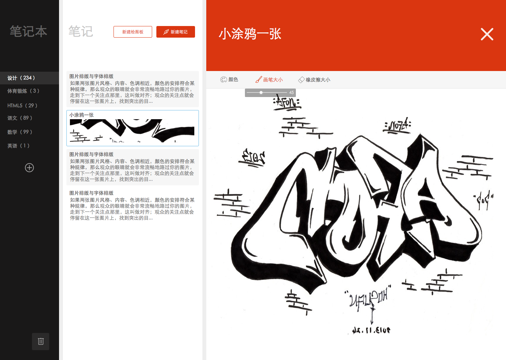

# RIA启航班任务二分支一：带高级增加绘图板功能的个人知识管理工具

## 任务描述：

基于任务一，实现一个带绘图功能的个人知识笔记管理网站

以上图仅作参考，大家可以随意按照自己的喜欢进行界面设计。

## 任务要求：

* 团队协作完成
* 基于Canvas实现绘图功能，可以使用鼠标进行屏幕绘图，支持绘图的颜色、笔触粗细的调整
* 不要求在同一个笔记里绘图与文字的混排，添加笔记时就需明确是增加Markdown笔记还是绘图笔记
* 支持在笔记列表中显示绘图的缩略图或者部分
* 允许使用Canvas绘图库，如ZRender等

## 任务时间

7月27日 至 8月14日

## 学习资料

* [春季班学习资料](https://github.com/baidu-ife/ife/tree/master/2015_spring/task/task0001)
* [春季班学习资料](https://github.com/baidu-ife/ife/tree/master/2015_spring/task/task0002)

### RIA(SAP)相关学习材料

* [what is a single page application (Wikipedia)](https://en.wikipedia.org/wiki/Single-page_application)
* [Single page apps in depth](http://singlepageappbook.com/index.html)
* [Important Considerations When Building Single Page Web Apps](http://code.tutsplus.com/tutorials/important-considerations-when-building-single-page-web-apps--net-29356)
* [JavaScript Single Page Application Frameworks](http://stackoverflow.com/questions/14336450/javascript-spa-frameworks-single-page-application)
* [Developing Single Page Apps with Backbone.js](https://singlepagebook.supportbee.com/)
* [AngularJS Tutorial - Building a Web App in 5 minutes](https://www.airpair.com/angularjs/building-angularjs-app-tutorial)
* [Building single page apps using web components](https://www.polymer-project.org/0.5/articles/spa.html)