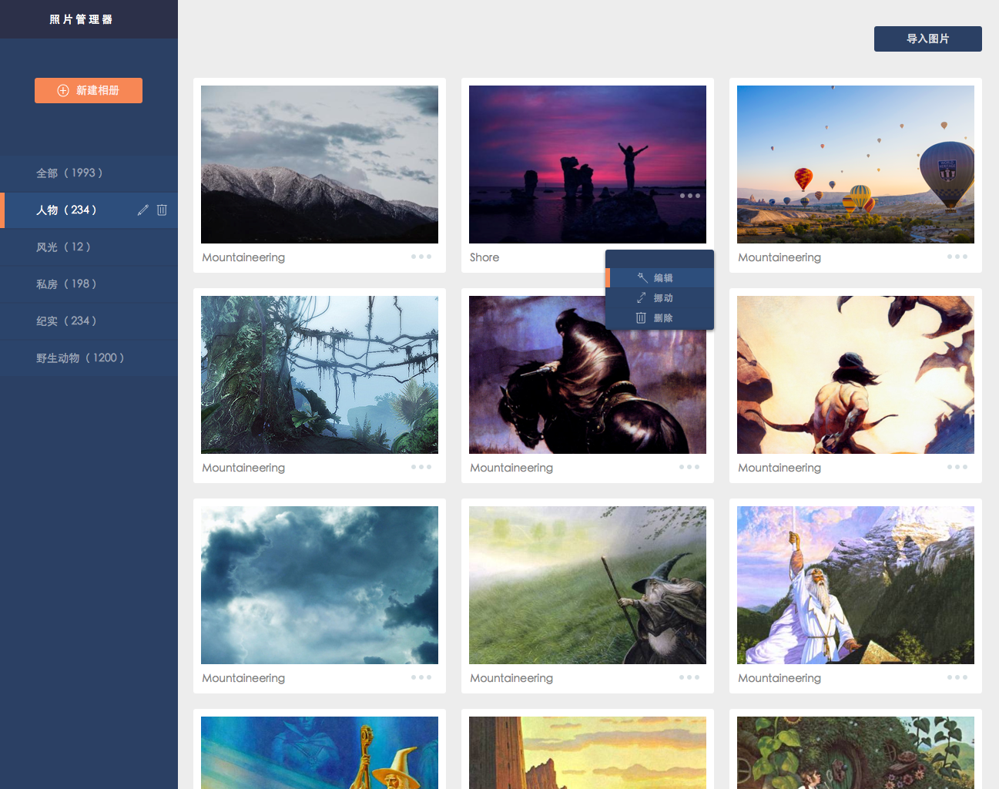

# RIA扬帆班任务一：图片网站

## 任务描述：

实现一个个人图片展示网站，包括展现及后台管理

以上图仅作参考，大家可以随意按照自己的喜欢进行界面设计。

## 任务要求：

* 团队协作完成
* 支持在管理端拖拽图片来改变图片的分类，以及图片在展示页面的排列顺序
* 支持在管理端通过拖拽分类来改变分类在展示页面的排序
* 支持在管理端上传图片，上传功能可以使用第三方组件，比如[WebUploader](http://github.com/fex-team/webuploader/)
* 除了jQuery及WebUploader，不允许使用其他框架类库
* 不需要登陆注册等功能
* 如果需要使用Server端，不限制语言，Server端框架使用不限制

## 任务时间

7月18日 至 7月26日

## 学习资料

* [春季班学习资料](https://github.com/baidu-ife/ife/tree/master/2015_spring/task/task0001)
* [春季班学习资料](https://github.com/baidu-ife/ife/tree/master/2015_spring/task/task0002)

### RIA(SAP)相关学习材料

* [what is a single page application (Wikipedia)](https://en.wikipedia.org/wiki/Single-page_application)
* [Single page apps in depth](http://singlepageappbook.com/index.html)
* [Important Considerations When Building Single Page Web Apps](http://code.tutsplus.com/tutorials/important-considerations-when-building-single-page-web-apps--net-29356)
* [JavaScript Single Page Application Frameworks](http://stackoverflow.com/questions/14336450/javascript-spa-frameworks-single-page-application)
* [Developing Single Page Apps with Backbone.js](https://singlepagebook.supportbee.com/)
* [AngularJS Tutorial - Building a Web App in 5 minutes](https://www.airpair.com/angularjs/building-angularjs-app-tutorial)
* [Building single page apps using web components](https://www.polymer-project.org/0.5/articles/spa.html)