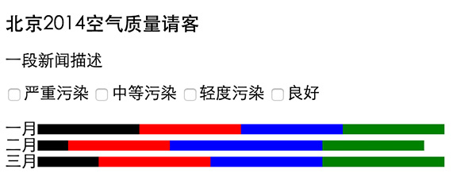

# 可视化启航班任务一：简单互动新闻说明

## 任务描述：

实现一个简单的网页，用于显示北京2014年空气质量情况，实现一个简单的可视化图表，并可以通过简单的交互来切换可视化呈现

以上图仅作参考，大家可以随意按照自己的喜欢进行界面设计。

## 任务要求：

* 个人完成，团队内部交流，互相评价代码
* 做完后在班级群里分享

## 任务时间

7月18日 至 7月26日

## 学习资料

* [视频代码示例](http://codepen.io/anon/pen/waxyKe)
* [教学视频](http://pan.baidu.com/s/1gdGUIHX)，密码: xy8i

* HTML

- [知乎上的一些Web基本概念介绍](http://www.zhihu.com/question/22689579)
- [慕课网HTML+CSS基础课程](http://www.imooc.com/learn/9)
- [w3school html教程](http://w3school.com.cn/html/index.asp)
- [MDN HTML](https://developer.mozilla.org/zh-CN/docs/Web/HTML/Introduction)

* CSS

- [MDN CSS](https://developer.mozilla.org/zh-CN/docs/Web/Guide/CSS/Getting_started)
- [w3school css](http://w3school.com.cn/css/index.asp)
- [慕课网HTML+CSS基础课程](http://www.imooc.com/learn/9)

* JavaScript

- [MDN](https://developer.mozilla.org/zh-CN/docs/Web/JavaScript)
- [慕课网JavaScript入门](http://www.imooc.com/learn/36)
- [慕课网JavaScript教程](http://www.imooc.com/learn/10)
- [w3school](http://www.w3school.com.cn/js/)
- [Codecademy](http://www.codecademy.com/tracks/javascript)
