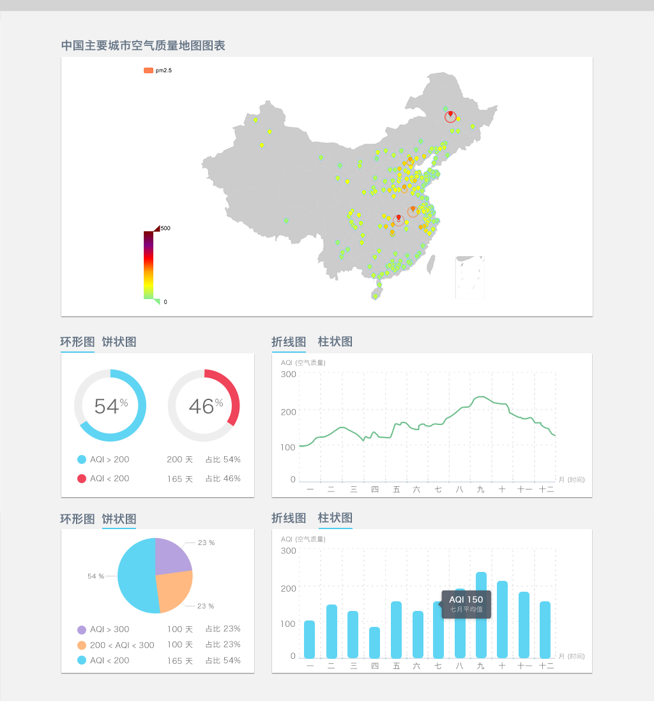

# 可视化扬帆班任务一：数据仪表盘

## 任务描述：

实现一个空气质量数据仪表盘，分别用不同的图表来展示不同城市的空气质量，如下图

示例图中的一些注意事项：

* 环形图和饼状图同时只出现一个，通过交互切换图表类型
* 折线图及柱状图同时只出现一个，通过交互切换图表类型

[参考数据](../asset/aqidata.xlsx)

以上图仅作参考，大家可以随意按照自己的喜欢进行界面设计。

## 任务要求：

* 团队协作完成
* 使用不同形式的图表（页面中至少同时展现3个图表）来表达数据含义，如示例图中，使用地图来表示不同城市的空气质量
* 必须有一些页面交互来进行数据图表展现的互动，包括图表之间的交互互动，或者是页面其他元素和图表的互动
* 可以使用任何组件、框架，如ECharts，D3.js等

## 任务时间

7月18日 至 7月26日

## 学习资料

* [春季班学习资料](https://github.com/baidu-ife/ife/tree/master/2015_spring/task/task0001)
* [春季班学习资料](https://github.com/baidu-ife/ife/tree/master/2015_spring/task/task0002)
