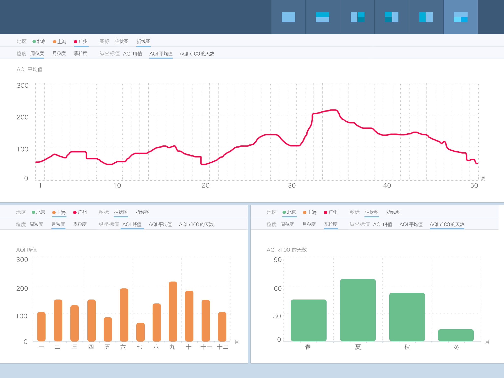

# 可视化扬帆班任务二：互动数据仪表盘

## 任务描述：

实现一个较为复杂的空气质量数据仪表盘，如下图

[参考数据](../asset/aqidata.xlsx)

以上图仅作参考，大家可以随意按照自己的喜欢进行界面设计。

## 任务要求：

* 团队协作完成
* 可以切换不同的仪表盘布局方式，如左右均分、上下均分，四分格等
* 每个图表都包括：地域选择、图表类型选择、时间统计粒度选择、统计维度选择
* 图表类型至少包括3种，可任选
* 时间统计粒度至少包括3种，可任选
* 统计维度选择至少包括3种，可任选
* 可以使用任何组件、框架，如jQuery，ECharts，D3.js等

## 任务时间

7月27日 至 8月14日

## 学习资料

* [春季班学习资料](https://github.com/baidu-ife/ife/tree/master/2015_spring/task/task0001)
* [春季班学习资料](https://github.com/baidu-ife/ife/tree/master/2015_spring/task/task0002)
