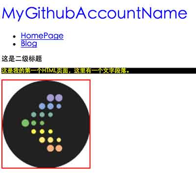
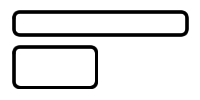
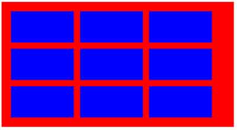
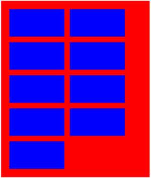
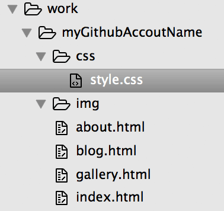

# HTML、CSS基础

**任务编号**：`TASK 0001`

## 任务目的

掌握`HTML`、`CSS`基础知识、能够较为熟练地使用`HTML`、`CSS`编写页面

## 任务前说明

本任务**1-6**小节的内容是面向零基础的同学，如果您已经有一定的基础，可以跳过前面你觉得确认已经掌握的内容。

对于零基础的同学，1-5小节建议用一天时间，第6小节建议用两到三天时间。

## 任务Review内容

最后会对`7.综合练习`的编码作业进行Review

## 任务Review截止时间

超过以下天数提交的代码不做Review

- 初级班：**11**天
- 中级班：**4**天

## Start

## 1. 建立你的第一个网页

### 1.1 任务描述

*面向零基础同学*

创建一个HTML文件，比如`task0001.html`文件，在里面实现一些代码，完成你的第一个网页。

这个页面中，需要有以下内容：

- 一个一级标题，内容是你的Github账号
- 一个无序列表，包括2个项目，里面每一个项目是一个链接，分别链接到`task0001.html`以及你的微博（或其他什么网站）
- 一个二级标题，内容随意（不能违法、反动、色情等）
- 一个段落，内容随意（不能违法、反动、色情等）
- 一个图片（不能违法、反动、色情等）。

最后的效果如下图：

### 1.2 期望达成

- 了解什么是Web
- 了解什么是HTML
- 了解一些基本的HTML语法及标签
- 能够写出自己的第一个HTML

### 1.3 参考资料

- [知乎上的一些Web基本概念介绍](http://www.zhihu.com/question/22689579)
- [慕课网HTML+CSS基础课程](http://www.imooc.com/learn/9)
- [w3school html教程](http://w3school.com.cn/html/index.asp)
- [MDN HTML](https://developer.mozilla.org/zh-CN/docs/Web/HTML/Introduction)

## 2. 给你的网页加点样式

### 2.1 任务描述

*面向零基础同学*

学习以下`CSS`是怎么运作的，然后创建一个`task0001.css`的文件，并在`task0001.html`中引入它，然后我们对`task0001.html`做一些让他变得花哨一点的事情：

- 让一级标题的文字颜色变成蓝色
- 二级标题的文字大小变成`14px`
- 段落的文字大小变成`12px`，文字颜色是黄色，带一个黑色的背景色
- 图片有一个红色的，`2px`粗的边框

效果如下图：

### 2.2 期望达成

- 了解什么是CSS
- 了解HTML与CSS是如何一起工作的
- 了解基本的CSS语法
- 尝试使用几个简单的CSS属性

### 2.3 参考资料

- [MDN CSS](https://developer.mozilla.org/zh-CN/docs/Web/Guide/CSS/Getting_started)的1，2，3节
- [w3school css](http://w3school.com.cn/css/index.asp)
- [慕课网HTML+CSS基础课程](http://www.imooc.com/learn/9)

## 3. 稍微放松一下

### 3.1 任务描述

*面向零基础同学*

了解一下HTML及CSS的发展史，了解一下HTML4到5究竟变化了什么

### 3.2 期望达成

- 对于HTML及CSS的发展史有一个大概的了解
- 明白HTML5和之前的版本大概有什么区别

### 3.3 参考资料

- [MDN HTML](https://developer.mozilla.org/zh-CN/docs/Web/HTML/Introduction)
- [MDN CSS](https://developer.mozilla.org/zh-CN/docs/Web/Guide/CSS/Getting_started)
- [w3school](http://w3school.com.cn/html5/index.asp)
- [W3C: HTML5, Differences from HTML4](http://www.w3.org/TR/html5-diff/)

## 4. CSS基础

### 4.1 任务描述

*面向零基础同学*

接下来我们深入学习HTML、CSS，首先深入了解CSS的各种选择器、继承、层叠、样式优先级机制。

### 4.2 期望达成

- 掌握CSS各种选择器
- 掌握CSS的继承、层叠、样式优先级机制

### 4.3 参考资料

- [MDN CSS的第4、5节](https://developer.mozilla.org/zh-CN/docs/Web/Guide/CSS/Getting_started)
- [w3school css](http://w3school.com.cn/css/index.asp)

## 5. 让页面样式丰富起来

### 5.1 任务描述

*面向零基础同学*

在你的`task0001.html`中，快速实践以下文本相关的所有属性内容：

- `text-indent`
- `text-transform`
- `text-decoration`
- `text-align`
- `word-spacing`
- `white-space`
- `color`
- `line-height`
- `font`
- `font-family`
- `font-size`
- `font-weight`
- `font-face`

### 5.2 期望达成

- 掌握文本、文字、链接相关的样式属性
- 掌握背景属性
- 掌握列表相关的样式属性
- 深入了解行高属性

### 5.3 参考资料

- [MDN CSS](https://developer.mozilla.org/zh-CN/docs/Web/Guide/CSS/Getting_started)
- [w3school css](http://w3school.com.cn/css/index.asp)
- [深入了解行高属性](http://www.cnblogs.com/fengzheng126/archive/2012/05/18/2507632.html)

## 6. 盒模型及定位

### 6.1 任务描述

在`task0001.html`中，实践以下内容：

- 用两种方法来实现一个背景色为`红色`、宽度为`960px`的`
`在浏览器中居中
- 有的圆角矩形是复杂图案，无法直接用border-radius，请在不使用border-radius的情况下实现一个可复用的高度和宽度都自适应的圆角矩形 
- 用两种不同的方法来实现一个两列布局，其中左侧部分宽度固定、右侧部分宽度随浏览器宽度的变化而自适应变化 
- 用两种不同的方式来实现一个三列布局，其中左侧和右侧的部分宽度固定，中间部分宽度随浏览器宽度的变化而自适应变化
- 实现一个浮动布局，红色容器中每一行的蓝色容器数量随着浏览器宽度的变化而变化  

### 6.2 期望达成

- 掌握块状元素、内联元素、和内联块状元素的概念与区别
- 掌握盒模型的所有概念，学会如何计算各种盒模型相关的数值
- 掌握`position`的相关知识
- 掌握`float`的相关知识
- 掌握基本的布局方式
- 了解`Grid`、`Flexbox`等布局方式

### 6.3 参考资料

- [w3school](http://w3school.com.cn/css/css_boxmodel.asp)
- [MDN](https://developer.mozilla.org/zh-CN/docs/CSS/%E5%BC%80%E5%A7%8B/Boxes)
- [慕课网](http://www.imooc.com/code/2047)
- [w3school](http://w3school.com.cn/css/css_positioning.asp)
- [慕课网](http://www.imooc.com/code/2057)
- [学习CSS布局](http://zh.learnlayout.com/no-layout.html)
- [CSS布局方式](http://teamtreehouse.com/library/css-layout-techniques)
- [双飞翼布局介绍-始于淘宝UED](http://www.imooc.com/wenda/detail/254035)
- [W3C Visual formatting model](http://www.w3.org/TR/CSS21/visuren.html#)
- [MDN Visual formatting model](https://developer.mozilla.org/en-US/docs/Web/Guide/CSS/Visual_formatting_model)
- [CSS 101: Block Formatting Context](http://www.yuiblog.com/blog/2010/05/19/css-101-block-formatting-contexts)
- [Block Formatting Context In CSS](http://outofmemory.cn/wr/?u=http%3A%2F%2Fkkeys.me%2Fpost%2F68547473290)
- [A new micro clearfix hack](http://nicolasgallagher.com/micro-clearfix-hack/)
- [那些年我们一起清除过的浮动 by 一丝冰凉](http://www.iyunlu.com/view/css-xhtml/55.html)
- [BFC和hasLayout](http://www.cnblogs.com/pigtail/archive/2013/01/23/2871627.html)

## 7. 综合练习

### 7.1 任务描述

在您自己的Github中建立一个新的仓库，比如命名为`task0001`，在该目录下创建以下四个html文件：

- `index.html`：对应`task0001_1`及`task0001_1_marked`设计稿
- `blog.html`：对应`task0001_2`及`task0001_2_marked`设计稿
- `gallery.html`：对应`task0001_3`及`task0001_3_marked`设计稿
- `about.html`：对应`task0001_4`及`task0001_4_marked`设计稿
 
再创建一个`css`目录，在`css`目录中创建一个`style.css`用于编写样式。

再创建一个`img`目录，用于存放页面编写中会使用到的图片。

这时，你的文件夹结构应该是这样的：

基于[设计稿](design/)中的设计图及标志实现页面，里面的内容、图片、配色均可自定义。

- 编码过程请尽可能遵守[HTML、CSS的代码规范](https://github.com/ecomfe/spec)；
- 暂时不要使用`less`、`sass`等，这是后面的任务；
- 不要使用任何样式框架。
- 不需要写任何JavaScript，只需要关注HTML、CSS
- 页面实际内容宽度为980px，头部背景、大图、底部背景均为100%宽，当浏览器宽度低于980px时，页面宽度不变，允许出现横向滚动条。右上角的Github图标在浏览器低于980px时消失。

**任务关键执行步骤**

- 按照以上要求进行编码，先不需要关注页面中任何具体的图片和文字内容，都随意输入，注意力放在页面架构、布局、样式上；
- 编码的同时，记录遇到的技术问题和疑惑；
- 完成编码后，删掉它们，不留一丝痕迹；
- 开始重(Chong)构(Xie)，让自己的代码要比第一次有提升，尽可能地让第一次遇到问题和疑惑不再存在；
- 在blog.html页面中真的写上2-3篇这次学习上的技术总结收获；
- 初级班同学请在[这里](https://github.com/baidu-ife/ife/issues/764)，按要求回复您的task0001的Github地址。

### 7.2 期望达成

- 学会能够基于设计稿来合理规划HTML结构
- 理解语义化，合理地使用HTML标签来构建页面
- 能够较为熟练地使用HTML、CSS创建一个静态页面
- 大概了解并实践企业中对于HTML及CSS的编码规范
- 编写复用性高、可读性、可维护性好的代码

### 7.3 参考资料

- [HTML、CSS的代码规范](https://github.com/ecomfe/spec)
- [顾轶灵:Web语义化](http://www.zhihu.com/question/20455165)
- [CSS命名规范@W3C Funs](http://www.w3cfuns.com/blog-5445898-5398950.html)
[点击阅读: CSS浏览器兼容性列表](http://en.wikipedia.org/wiki/Comparison_of_layout_engines_%28Cascading_Style_Sheets%29)

## 8. 验证

经过上面的练习，您是否已经能够熟练到能够在一天甚至半天之内完成任务7的编码呢？或者不带任何犹豫地可以知道

- `doctype`是什么，它是干啥用的
- `ul`、`ol`、`dl`都适合用在什么地方
- 能够娓娓道来你是怎么理解HTML语义化的
- CSS选择器都有哪些
- `position`都有什么值，区别是什么
- 经典的清除浮动代码中每一行语句都是干什么用的，为什么少了它不行
- 让一个HTML节点居中的各种实现方式
- 神马圣杯布局、双飞翼布局都是些什么东西
- 强大的负外边距都能干嘛
- 不小心提起文档流的时候还能接着解释到底啥是文档流
- ……

关于HTML、CSS，我们暂时到这里，下一个任务我们将进行JavaScript的一些基础训练。
