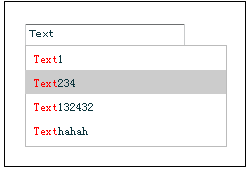
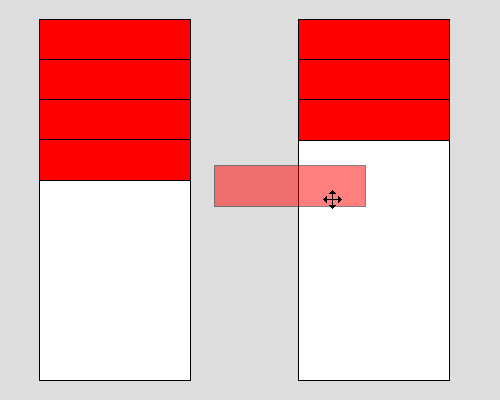

# JavaScript基础

**任务编号**：`TASK 0002`

## 任务目的

掌握`JavaScript`基础知识，能够使用`JavaScript`编写一些复杂度不大的交互功能。

## 任务Review截止时间

超过以下天数提交的代码不做Review

- 初级班：**13**天
- 中级班：**7**天

## 参考资料

- [MDN](https://developer.mozilla.org/zh-CN/docs/Web/JavaScript)
- [慕课网JavaScript入门](http://www.imooc.com/learn/36)
- [慕课网JavaScript教程](http://www.imooc.com/learn/10)
- [w3school](http://www.w3school.com.cn/js/)
- [Codecademy](http://www.codecademy.com/tracks/javascript)

## Start

## 1. 创建第一个页面交互

### 1.1 任务描述

*面向零基础学员*

在自己的Github中创建一个新的目录，比如`task0002`，在该目录下首先创建一个没有内容的页面： `task0002.html`，这个页面需要包含最基本的HTML结构，它将用于我们后面的任务。

```html
<!DOCTYPE html>
<html>
<head>
    <meta charset="UTF-8">
    <title>task0002</title>
</head>

<body>
</body>
</html>
```


使用刚刚创建好的`task0002.html`，在这个页面的`</body>`前增加这么一段代码

```javascript
<script>
alert("Hello World!");
</script>
```

刷新一下页面，DONE

好吧，这是我们很多年前才干的事情，现在更多时候是这样的

```javascript
<script>
console.log("Hello World!");
</script>
```

刷新一下页面，在Chrome中打开开发者工具，看看控制台里发生了什么。记住这个`console.log`，后续你会经常用着它。

接下来来点稍微复杂的，在你的`task0002.html`的`<body>`后增加下面的代码

```html
<input id="number1" type="text">
<input id="number2" type="text">
<span id="result"></span>
<button id="addbtn"></button>
```

同时，在`<script>`标签中做一下修改

```javascript
<script>
function $(id) {
    return document.getElementById(id);
}

function add(num1, num2) {
    return num1 + num2;
}

function renderResult(result) {
    $("result").innerHTML = result;
}

function addEventHandle() {
    var num1 = $("number1").value;
    var num2 = $("number2").value;
    var result = add(num1, num2);
    renderResult(result);
}

function initEvent() {
    $("addbtn").addEventListener("click", addEventHandle, false);
}

initEvent();
</script>
```

试试在Chrome下看看什么效果，再看看在IE8下什么效果。是不是有什么区别呢？先不着急寻找答案。

然后，试着建立一个新的`xxxx.js`的文件，把上面`<script>`里面的内容剪贴过去，在html中引入这个文件。

接下来的课程主要围绕JavaScript自身的一些基础知识，如果你对计算机编程本身还是不够熟悉，那就建议花比别人更多的时间多写点代码。

## 1.2 期望达成

- 了解JavaScript是什么
- 如何在HTML页面加载JavaScript代码
- 搜索一下，为什么我们让你把`<script>`放在`</body>`前。

## 1.3 参考资料

- [JavaScript 的性能优化：加载和执行](http://www.ibm.com/developerworks/cn/web/1308_caiys_jsload/index.html)

## 2. JavaScript数据类型及语言基础

### 2.1 任务描述

- 创建一个JavaScript文件，比如`util.js`；
- 实践判断各种数据类型的方法，并在`util.js`中实现以下方法：

```javascript
// 判断arr是否为一个数组，返回一个bool值
function isArray(arr) {
    // your implement
}

// 判断fn是否为一个函数，返回一个bool值
function isFunction(fn) {
    // your implement
}
```

- 了解值类型和引用类型的区别，了解各种对象的读取、遍历方式，并在`util.js`中实现以下方法：

```javascript
// 使用递归来实现一个深度克隆，可以复制一个目标对象，返回一个完整拷贝
// 被复制的对象类型会被限制为数字、字符串、布尔、日期、数组、Object对象。不会包含函数、正则对象等
function cloneObject(src) {
    // your implement
}

// 测试用例：
var srcObj = {
    a: 1,
    b: {
        b1: ["hello", "hi"],
        b2: "JavaScript"
    }
};
var abObj = srcObj;
var tarObj = cloneObject(srcObj);

srcObj.a = 2;
srcObj.b.b1[0] = "Hello";

console.log(abObj.a);
console.log(abObj.b.b1[0]);

console.log(tarObj.a);      // 1
console.log(tarObj.b.b1[0]);    // "hello"
```

- 学习数组、字符串、数字等相关方法，在`util.js`中实现以下函数

```javascript
// 对数组进行去重操作，只考虑数组中元素为数字或字符串，返回一个去重后的数组
function uniqArray(arr) {
    // your implement
}

// 使用示例
var a = [1, 3, 5, 7, 5, 3];
var b = uniqArray(a);
console.log(b); // [1, 3, 5, 7]

// 中级班同学跳过此题
// 实现一个简单的trim函数，用于去除一个字符串，头部和尾部的空白字符
// 假定空白字符只有半角空格、Tab
// 练习通过循环，以及字符串的一些基本方法，分别扫描字符串str头部和尾部是否有连续的空白字符，并且删掉他们，最后返回一个完成去除的字符串
function simpleTrim(str) {
    // your implement
}

// 很多同学肯定对于上面的代码看不下去，接下来，我们真正实现一个trim
// 对字符串头尾进行空格字符的去除、包括全角半角空格、Tab等，返回一个字符串
// 尝试使用一行简洁的正则表达式完成该题目
function trim(str) {
    // your implement
}

// 使用示例
var str = '   hi!  ';
str = trim(str);
console.log(str); // 'hi!'

// 实现一个遍历数组的方法，针对数组中每一个元素执行fn函数，并将数组索引和元素作为参数传递
function each(arr, fn) {
    // your implement
}

// 其中fn函数可以接受两个参数：item和index

// 使用示例
var arr = ['java', 'c', 'php', 'html'];
function output(item) {
    console.log(item)
}
each(arr, output);  // java, c, php, html

// 使用示例
var arr = ['java', 'c', 'php', 'html'];
function output(item, index) {
    console.log(index + ': ' + item)
}
each(arr, output);  // 0:java, 1:c, 2:php, 3:html

// 获取一个对象里面第一层元素的数量，返回一个整数
function getObjectLength(obj) {}

// 使用示例
var obj = {
    a: 1,
    b: 2,
    c: {
        c1: 3,
        c2: 4
    }
};
console.log(getObjectLength(obj)); // 3

```

- 学习正则表达式，在`util.js`完成以下代码

```
// 判断是否为邮箱地址
function isEmail(emailStr) {
    // your implement
}

// 判断是否为手机号
function isMobilePhone(phone) {
    // your implement
}
```

### 2.2 期望达成

- 掌握JavaScript的各种数据类型概念、判断方法
- 掌握JavaScript函数、对象的概念
- 掌握字符串、数字、数组、日期等对象的方法
- 了解JavaScript的作用域
- 初步掌握正则表达式的写法

### 2.3 参考资料

- [JavaScript 数据结构](https://developer.mozilla.org/zh-CN/docs/Web/JavaScript/Data_structures)
- [MDN Array](https://developer.mozilla.org/zh-CN/docs/Web/JavaScript/Reference/Global_Objects/Array)
- [MDN String](https://developer.mozilla.org/zh-CN/docs/Web/JavaScript/Reference/Global_Objects/String)
- [MDN Number](https://developer.mozilla.org/zh-CN/docs/Web/JavaScript/Reference/Global_Objects/Number)
- [MDN 正则](https://developer.mozilla.org/zh-CN/docs/Web/JavaScript/Reference/Global_Objects/RegExp)

## 3. DOM

### 3.1 任务描述

先来一些简单的，在你的`util.js`中完成以下任务：

```javascript
// 为element增加一个样式名为newClassName的新样式
function addClass(element, newClassName) {
    // your implement
}

// 移除element中的样式oldClassName
function removeClass(element, oldClassName) {
    // your implement
}

// 判断siblingNode和element是否为同一个父元素下的同一级的元素，返回bool值
function isSiblingNode(element, siblingNode) {
    // your implement
}

// 获取element相对于浏览器窗口的位置，返回一个对象{x, y}
function getPosition(element) {
    // your implement
}
// your implement
```

接下来挑战一个`mini $`，它和之前的`$`是不兼容的，它应该是`document.querySelector`的功能子集，在不直接使用`document.querySelector`的情况下，在你的`util.js`中完成以下任务：

```javascript
// 实现一个简单的Query
function $(selector) {
    
}

// 可以通过id获取DOM对象，通过#标示，例如
$("#adom"); // 返回id为adom的DOM对象

// 可以通过tagName获取DOM对象，例如
$("a"); // 返回第一个<a>对象

// 可以通过样式名称获取DOM对象，例如
$(".classa"); // 返回第一个样式定义包含classa的对象

// 可以通过attribute匹配获取DOM对象，例如
$("[data-log]"); // 返回第一个包含属性data-log的对象

$("[data-time=2015]"); // 返回第一个包含属性data-time且值为2015的对象

// 可以通过简单的组合提高查询便利性，例如
$("#adom .classa"); // 返回id为adom的DOM所包含的所有子节点中，第一个样式定义包含classa的对象
```

### 3.2 期望达成

- 非常熟练掌握DOM的相关操作

### 3.3 参考资料

- [DOM](https://developer.mozilla.org/zh-CN/docs/Web/JavaScript/JavaScript_technologies_overview)
- [MDN QuerySelector](https://developer.mozilla.org/en-US/docs/Web/API/Document/querySelector)
- [MDN QuerySelectorAll](https://developer.mozilla.org/en-US/docs/Web/API/Document/querySelectorAll)

## 4. 事件

### 4.1 任务描述

我们来继续用封装自己的小jQuery库来实现我们对于JavaScript事件的学习，还是在你的`util.js`，实现以下函数

```javascript
// 给一个element绑定一个针对event事件的响应，响应函数为listener
function addEvent(element, event, listener) {
    // your implement
}

// 例如：
function clicklistener(event) {
    ...
}
addEvent($("#doma"), "click", a);

// 移除element对象对于event事件发生时执行listener的响应
function removeEvent(element, event, listener) {
    // your implement
}
```

接下来我们实现一些方便的事件方法
```javascript
// 实现对click事件的绑定
function addClickEvent(element, listener) {
    // your implement
}

// 实现对于按Enter键时的事件绑定
function addEnterEvent(element, listener) {
    // your implement
}
```

接下来我们把上面几个函数和$做一下结合，把他们变成$对象的一些方法
- addEvent(element, event, listener) -> $.on(element, event, listener);
- removeEvent(element, event, listener) -> $.un(element, event, listener);
- addClickEvent(element, listener) -> $.click(element, listener);
- addEnterEvent(element, listener) -> $.enter(element, listener);

接下来考虑这样一个场景，我们需要对一个列表里所有的`<li>`增加点击事件的监听

**最笨的方法**

```html
<ul id="list">
    <li id="item1">Simon</li>
    <li id="item2">Kenner</li>
    <li id="item3">Erik</li>
</ul>
```

```javascript
function clickListener(event) {
    console.log(event);
}

$.click($("#item1"), clickListener);
$.click($("#item2"), clickListener);
$.click($("#item3"), clickListener);
```

上面这段代码要针对每一个item去绑定事件，这样显然是一件很麻烦的事情。

**稍微好一些的**

```html
<ul id="list">
    <li>Simon</li>
    <li>Kenner</li>
    <li>Erik</li>
</ul>
```

我们试图改造一下

```javascript
function clickListener(event) {
    console.log(event);
}

each($("#list").getElementsByTagName('li'), function(li) {
    addClickEvent(li, clickListener);
});
```

我们通过自己写的函数，取到id为`list`这个`ul`里面的所有`li`，然后通过遍历给他们绑定事件。这样我们就不需要一个一个去绑定了。但是看看以下代码：

```html
<ul id="list">
    <li id="item1">Simon</li>
    <li id="item2">Kenner</li>
    <li id="item3">Erik</li>
</ul>
<button id="btn">Change</button>
```

```javascript
function clickListener(event) {
    console.log(event);
}

function renderList() {
    $("#list").innerHTML = '<li>new item</li>';
}

function init() {
    each($("#list").getElementsByTagName('li'), function(item) {
        $.click(item, clickListener);
    });

    $.click($("#btn"), renderList);
}
init();
```

我们增加了一个按钮，当点击按钮时，改变list里面的项目，这个时候你再点击一下`li`，绑定事件不再生效了。那是不是我们每次改变了DOM结构或者内容后，都需要重新绑定事件呢？当然不会这么笨，接下来学习一下事件代理，然后实现下面新的方法：

```javascript
// 先简单一些
function delegateEvent(element, tag, eventName, listener) {
    // your implement
}

$.delegate = delegateEvent;

// 使用示例
// 还是上面那段HTML，实现对list这个ul里面所有li的click事件进行响应
$.delegate($("#list"), "li", "click", clickHandle);
```

估计有同学已经开始吐槽了，函数里面一堆$看着晕啊，那么接下来把我们的事件函数做如下封装改变：

```javascript
$.on(selector, event, listener) {
    // your implement
}

$.click(selector, listener) {
    // your implement
}

$.un(selector, event, listener) {
    // your implement
}

$.delegate(selector, tag, event, listener) {
    // your implement
}

// 使用示例：
$.click("[data-log]", logListener);
$.delegate('#list', "li", "click", liClicker);
```

### 4.2 期望达成

- 熟悉DOM事件相关知识

### 4.3 参考资料

- [W3School](http://www.w3school.com.cn/jsref/jsref_events.asp)
- [慕课网 DOM事件](http://www.imooc.com/view/138)
- [JavaScript事件代理](http://www.cnblogs.com/rubylouvre/archive/2009/08/09/1542174.html)
- [W3C](https://dvcs.w3.org/hg/dom3events/raw-file/tip/html/DOM3-Events.html)

## 5. BOM

### 5.1 任务描述

实现以下函数

```
// 判断是否为IE浏览器，返回-1或者版本号
function isIE() {
    // your implement
}

// 设置cookie
function setCookie(cookieName, cookieValue, expiredays) {
    // your implement
}

// 获取cookie值
function getCookie(cookieName) {
    // your implement
}

```

### 5.2 期望达成

- 了解BOM的基础知识

### 5.3 参考资料

- [w3school](http://w3school.com.cn/js/js_window.asp)

## 6. Ajax

### 6.1 任务描述

学习Ajax，并尝试自己封装一个Ajax方法。实现如下方法：

```javascript
// 
function ajax(url, options) {
    // your implement
}

// 使用示例：
ajax(
    'http://localhost:8080/server/ajaxtest', 
    {
        data: {
            name: 'simon',
            password: '123456'
        },
        onsuccess: function (responseText, xhr) {
            console.log(responseText);
        }
    }
);
```

options是一个对象，里面可以包括的参数为：

- type: `post`或者`get`，可以有一个默认值
- data: 发送的数据，为一个键值对象或者为一个用&连接的赋值字符串
- onsuccess: 成功时的调用函数
- onfail: 失败时的调用函数

### 6.2 期望达成

- 掌握Ajax的实现方式

### 6.3 参考资料

- [w3school](http://www.w3school.com.cn/ajax/)
- [Comet](http://www.ibm.com/developerworks/cn/web/wa-lo-comet/)

## 小练习1

### 任务描述

在`task0002`目录下创建一个`task0002_1.html`文件，以及一个`js`目录和`css`目录，在`js`目录中创建`task0002_1.js`，并将之前写的`util.js`也拷贝到`js`目录下。然后完成以下需求。

**第一阶段**

在页面中，有一个单行输入框，一个按钮，输入框中用来输入用户的兴趣爱好，允许用户用半角逗号来作为不同爱好的分隔。

当点击按钮时，把用户输入的兴趣爱好，按照上面所说的分隔符分开后保存到一个数组，过滤掉空的、重复的爱好，在按钮下方创建一个段落显示处理后的爱好。

**第二阶段**

单行变成多行输入框，一个按钮，输入框中用来输入用户的兴趣爱好，允许用户用换行、空格（全角/半角）、逗号（全角/半角）、顿号、分号来作为不同爱好的分隔。

当点击按钮时的行为同上

**第三阶段**

用户输入的爱好数量不能超过10个，也不能什么都不输入。当发生异常时，在按钮上方显示一段红色的错误提示文字，并且不继续执行后面的行为；当输入正确时，提示文字消失。

同时，当点击按钮时，不再是输出到一个段落，而是每一个爱好输出成为一个checkbox，爱好内容作为checkbox的label。

## 小练习2

### 任务描述

在和上一任务同一目录下面创建一个`task0002_2.html`文件，在`js`目录中创建`task0002_2.js`，并在其中编码，实现一个倒计时功能。

- 界面首先有一个文本输入框，允许按照特定的格式`YYYY-MM-DD`输入年月日；
- 输入框旁有一个按钮，点击按钮后，计算当前距离输入的日期的00:00:00有多少时间差
- 在页面中显示，距离YYYY年MM月DD日还有XX天XX小时XX分XX秒
- 每一秒钟更新倒计时上显示的数
- 如果时差为0，则倒计时停止

## 小练习3：轮播图

### 任务描述

在和上一任务同一目录下面创建一个`task0002_3.html`文件，在`js`目录中创建`task0002_3.js`，并在其中编码，实现一个轮播图的功能。

- 图片数量及URL均在HTML中写好
- 可以配置轮播的顺序（正序、逆序）、是否循环、间隔时长
- 图片切换的动画要流畅
- 在轮播图下方自动生成对应图片的小点，点击小点，轮播图自动动画切换到对应的图片

效果示例：[http://echarts.baidu.com/](http://echarts.baidu.com/) 上面的轮播图（不需要做左右两个箭头）

## 小练习4：输入提示框

在和上一任务同一目录下面创建一个`task0002_4.html`文件，在`js`目录中创建`task0002_4.js`，并在其中编码，实现一个类似百度搜索框的输入提示的功能。

要求如下：

- 允许使用鼠标点击选中提示栏中的某个选项
- 允许使用键盘上下键来选中提示栏中的某个选项，回车确认选中
- 选中后，提示内容变更到输入框中

**初级班：**

- 不要求和后端交互，可以自己伪造一份提示数据例如：

```
var suggestData = ['Simon', 'Erik', 'Kener'];
```

**中级班：**

- 自己搭建一个后端Server，使用Ajax来获取提示数据

示例：



## 小练习5：界面拖拽交互

- 实现一个可拖拽交互的界面
- 如示例图，左右两侧各有一个容器，里面的选项可以通过拖拽来左右移动
- 被选择拖拽的容器在拖拽过程后，在原容器中消失，跟随鼠标移动
- 注意拖拽释放后，要添加到准确的位置
- 拖拽到什么位置认为是可以添加到新容器的规则自己定
- 注意交互中良好的用户体验和使用引导



## 任务提交方式

- 初级班同学请在[这里](https://github.com/baidu-ife/ife/issues/766)，按要求回复您的task0002的Github地址。
- 中级班同学请在[这里](https://github.com/baidu-ife/ife/issues/765)，按要求回复您的task0002的Github地址。
