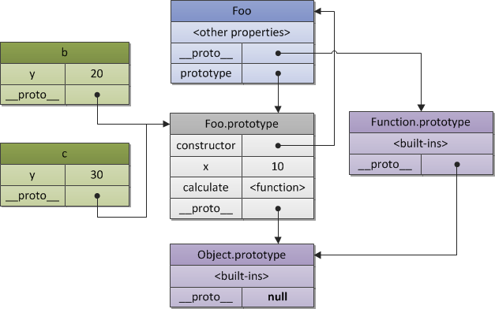
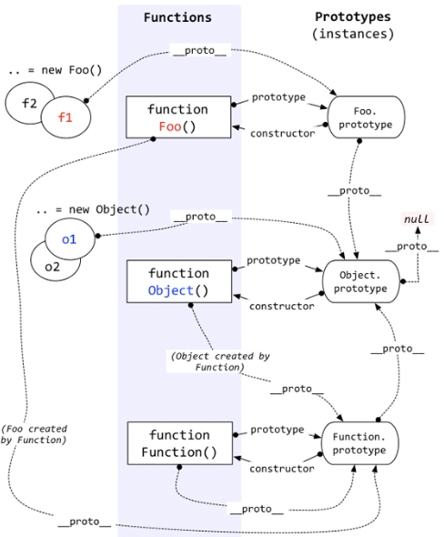

#JavaScript原型学习笔记#

----------
* 原型
* 分步声明
* 重写原型
* 原型链

----------

##原型##

原型是一个对象，其他对象可以通过原型实现属性继承。

所有的对象（不包括undefined，null，boolean，number，string等主数据类型）在默认的情况下都有一个原型，因为原型本身也是对象，所以每个原型自身又有一个原型。

###获取对象原型的方法###

不同的浏览器支持不同的获取**原型对象**的方法。

	var a = {};
	
	//FireFox 3.6 and Chrome 5
	Object.getPrototypeOf(a);	//[object Object]

	//Firefox 3.6, Chrome 5 and Safari 4
	a._proto_;					//[object Object]

	//all browsers
	a.constructor.prototype;	//[object Object]

如果试图获取一个主数据类型的原型时，会被强制转化成一个对象。例如：`false._proto_ === Boolean(false)._proto_;	//true`。

###constructor.prototype###

函数的**原型属性**（prototype property）是一个对象，当这个函数被用作构造函数来创建实例的时候，该函数的原型属性将被作为原型赋值给所有对象实例，即所有实例的原型引用的是函数的原型属性。

----------

**标注一下下：**

`a._proto_`和`a.constructor.prototype`表示a函数的原型对象。两个表达的是一个东西，只是针对不同的浏览器而已。

`a.prototype`表示a函数的原型属性，同时也是a作为构造函数所创建的新对象的原型对象。

**噢耶斯！这下算是说明白了！！！**

----------

每一个对象都有一个隐藏的属性——“`_proto_`”，这个属性**引用**了创建这个对象的函数的prototype。即`fn._proto_ === Fn.prototype`。

函数的“`_proto_`”属性指向的是Function.prototype。

Function.prototype的“`_proto_`”属性指向的是Object.prototype。

函数的prototype的“`_proto_`”属性指向的是Object.prototype。

Object.prototype的“`_proto_`”指向的是null。

示例：

----------

###更改构造函数的原型###

如果更改了构造函数的原型，是否意味着已经存在的该构造函数的实例将获得构造函数的最新版本？

* 如果修改的是**原型属性**，那么将**会改变实例**。这是因为实例对象的原型（例：`a._proto_`）是对构造函数的原型属性的引用。原型属性发生的改变会影响到对象实例中。
* 如果修改的是构造函数的**原型**，则**不会对已创建的对象实例有影响**。
* 如果改变了构造函数的**原型属性所指的对象**，**会改变**以后创建实例时实例原型所指向的对象，但**不会影响**已经创建的对象实例的原型。

##分步声明##

假设有如下代码：

	var BaseCalculator = function() {
		this.decimalDigits = 2;
	};

	BaseCalculator.prototype = {
		add: function(x, y) {
			return x + y;
		}
		subtract: function(x, y) {
			return x - y;
		}
	};

	var Calculator = function() {
		this.tax = 5;
	}

如果想要让Calculator集成BaseCalculator的add(x,y)和subtract(x, y)，可以将Calculator的原型指到BaseCalculator的一个实例上，即`Calculator.prototype = new BaseCalculator();`。在这种情况下，不论创建多少个Calculator对象实例，他们的原型都指向的是同一个实例。

但是需要注意，在上述情况下，Calculator是可以访问BaseCalculator的decimalDigits属性。如果想要避免这种情况，可以变成`Calculator.prototype = BaseCalculator.prototype;`。

##重写原型##

在使用第三方JS类库是，有时候需要重写原型中的一个或多个属性或function。可以通过继续声明同样的属性或函数代码的形式来达到覆盖重写。

要**注意**，重写的代码需要放在最后才能覆盖前面的代码。

##原型链##

因为每个对象和原型都有一个原型(**注:原型也是一个对象**)，对象的原型指向对象的父（继承），而父的原型又指向父的父，这种通过原型层层连接起来的关系就是原型链。这条链的末端一般总是默认的对象原型（{}）。

原型的继承机制是发生在内部且是隐式的。当想要获得一个对象a的属性foo的值，JavaScript会在原型链中查找foo的存在，如果找到则返回foo的值，否则undefined被返回。

当属性值被设置成a.foo='bar'，是直接给a的属性foo设置了一个值bar。为了把一个属性添加到原型中，需要直接指定该原型。

----------
下面这部分不会命名了先隔开- -

任何一个对象都有一个prototype属性，记为：`_proto_`。每当定义一个prototype的时候，就相当于把该对象的`_proto_`属性指向一个结构体，这个结构体就是该对象的原型。当然，不指定`_proto_`的时候，对象也会预留着这个属性，指向的是最高级的Object.prototype。Object.prototype的`_proto_`为空。

（感觉上面那部分是针对于变量，下面是针对于函数- -）

**当定义了一个prototype的时候，会构造一个原型对象，这个原型对象存储于构造这个prototype的函数的原型方法之中。**

示例：
    function Foo() {
    	this.value = 42;
	}
	Foo.prototype = {
    	method: function() {}
	};

	function Bar() {}

	// 设置Bar的prototype属性为Foo的实例对象
	Bar.prototype = new Foo();
	Bar.prototype.foo = 'Hello World';

	// 修正Bar.prototype.constructor为Bar本身
	Bar.prototype.constructor = Bar;

	var test = new Bar() // 创建Bar的一个新实例

	// 原型链
	test [Bar的实例]
		Bar.prototype [Foo的实例] 
        	{ foo: 'Hello World' }
       		Foo.prototype
            	{method: ...};
            	Object.prototype
                	{toString: ... /* etc. */};

test对象从Bar.prototype和Foo.prototype 继承下来,因此，它能访问 Foo的原型方法 method。同时，它也能够访问那个定义在原型上的Foo实例属性value。需要注意的是new Bar()不会创造出一个新的Foo实例，而是重复使用它原型上的那个实例；因此，所有的Bar实例都会共享相同的value属性。

----------
###instance of和原型的关系###

如果a的原型属于A的原型链，则表达式a instance of A的值为true。

	var A = function() {}   
	var a = new A(); 
 
	a.__proto__ == A.prototype; //true
	a instanceof A; //true;   
 
	//mess around with a's prototype 
 
	a.__proto__ = Function.prototype; 
	a instanceof A; //false

###属性查找###

当查找一个对象的属性时，JavaScript会向上遍历原型链，知道找到给定名称的属性为止，到查到到达原型链的顶部 - 也就是Object.prototype - 但是仍然没有找到指定的属性，就会返回undefined。

**注意：**属性在查找的时候是先查找自身的属性，如果没有再查找原型，再没有，再往上走，一直查到Object的原型上。另外，除了原子类型的值以外，可以赋值任何类型的对象到原型上。

###hasOwnProperty函数###

hasOwnProperty是Object.prototype的一个方法，是JavaScript里唯一一个处理属性但是不查找原型链的函数。可以判断一个对象是否包含自定义属性而不是原型链上的属性。

**注意：**JavaScript不会保护hasOwnProperty被非法占用。如果一个对象碰巧有这个属性，则需要使用外部的hasOwnProperty函数来获取结果。例如：

    var foo = {
    	hasOwnProperty: function() {
    		return palse;
    	},
    	bar: 'Here be dragons'
    };
    
    foo.hasOwnProperty('bar');	//总是返回false
    
    //使用外部的{}对象的hasOwnProperty，并将其上下围设置为foo
    {}.hasOwnProperty.call(foo, 'bar');	//true

另外，在使用for in loop遍历对象时，推荐总是使用hasOwnProperty来判断，可以避免原型对象扩展带来的干扰。

	for (var i in foo) {
		if (foo.hasOwnProperty(i)) {
			console.log(i);
		}
	}

