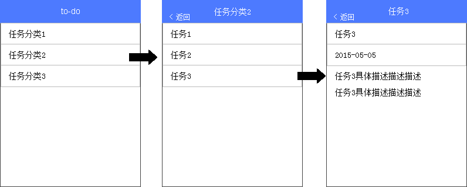
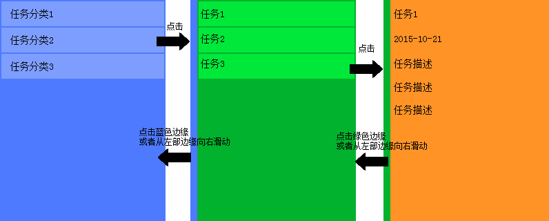

# 最终挑战

## 任务背景

经过任务一和任务二，我们分别学习了HTML、CSS、JavaScript的一些基础知识，通过任务三，我们加深了对JavaScript的认识，并且做了一个还算小复杂的项目。

在最后一个任务中，我们将花最多的时间，来看看在真实互联网企业中做一个较为复杂的项目都还需要了解什么样的知识内容。在这个课程中，我们希望通过自学各种技术文章、书籍，进行代码实践，进行总结分享、交流，来学习到以下知识内容：

* 移动Web开发
* CSS Processing
* 前端安全
* 性能优化
* JavaScript模块化
* 前端工程化

在每一个知识方向上，我们希望你通过学到的知识点，针对你的任务三进行重构。

在正式开始之前，让我们回顾一下我们最开始的初心。我们一直期望在这个课程中，大家更关注的是掌握各种知识点，而不是完成任务。我们希望您学一个点就学懂、学透，而不是勉勉强强、着着急急把任务做完，然后什么技能也没掌握透彻。

任务的时间限制多数时候是告诉大家这部分内容我们认为用多长的时间你是可以掌握学习的，同时也是为了给大家一个deadline来推动大家学习，经过两个多月的过程中，少部分同学因为各种学业压力、或者其他自身原因退出，但我也能看见更多的同学以及逐渐地具备了很强的主动学习能力，而不是被我们的任务时间压着走。我们也不断地根据大家的实际学习情况来调整任务学习时长。

在最后一个任务（或者说成是任务三+任务四），我们会充分相信大家的主动性，不再严格限制任务完成的时间，以及任务完成的要求。我们会给出每一个技术点建议的学习时长。然后我们会以类似电话面试的方式来进行对于所有任务完成的一个综合考核，也算是大家的毕业答辩。

感谢大家在这段时间对于我们的关注、参与，感谢给我们提出各自建议的同学，更感谢整个过程中，当我们工作出现失误、懈怠时给与的包容和鼓励。这几个月不仅仅是各位学习的时间，也是我们一个成长的阶段，我们会持续不断地通过自己的努力为广大热爱前端、希望学习前端的人们提供帮助。也衷心预祝各位第一期的学员能够通过这段时间，学有所成！

## 移动开发

往前推2到3年，前端工程师还在忧心忡忡地想，移动互联网时代下，前端是不是没有生存空间了。但今天一看，在我们团队，前端工程师超过一半的工作都是在做移动端的Web或者APP的开发。移动Web或者APP在技术本质上是和做桌面端Web没有本质区别，但是移动端的坑那是非常的多，通过学习这部分内容，让你成为一名桌面移动通吃的前端开发工程师。

### 推荐实践任务

* 学习了解移动开发相关经验
* 初级班按照[这个设计图](design/mobile_1.png)完成针对任务三的移动版开发
* 中级班按照[这个设计图](design/mobile_2.png)完成针对任务三的移动版开发

### 初级班任务详细说明

如上图，实现一个移动端的简化版to-do，数据和任务三保持一致，支持以下功能：

* 分类列表的显示
* 点击某个分类后进入该分类的子分类或任务中
* 点击某个任务后显示这个任务的具体内容
* 左上角有一个返回按钮用于返回上一级

细节要求：

* 整个产品为SPA
* 样式设计不需要和设计稿一致，可以自行设计
* 不要求有写操作，但如果有余力可自行添加
* 可以但不推荐使用第三方的手势库及基础库，比如Hammer.js，Zepto.js等
* 可以但不推荐使用框架来实现SPA，如果选择使用框架来实现，建议尝试使用多种框架分别实现一遍，并总结不同框架的设计思想，分析核心模块的代码设计

### 中级班任务详细说明

如上图，实现一个移动端的简化版to-do，数据和任务三保持一致，支持以下功能：

* 分类列表的显示
* 点击某个分类后进入该分类的子分类或任务中
* 点击某个任务后显示这个任务的具体内容
* 点击屏幕左边缘或者从左向右滑动，可以返回上一级

细节要求：

* 整个产品为SPA
* 样式设计不需要和设计稿一致，可以自行设计
* 不要求有写操作，但如果有余力可自行添加
* 切换内容屏幕时要求有动画效果，比如点击进入下一级时，有个页面整体向左滑动的效果，返回上一级时是整体向右滑动。
* 可以但不推荐使用第三方的手势库及基础库，比如Hammer.js，Zepto.js等
* 可以但不推荐使用框架来实现SPA，如果选择使用框架来实现，建议尝试使用多种框架分别实现一遍，并总结不同框架的设计思想，分析核心模块的代码设计

### 推荐学习时间

* 1-2天学习资料
* 3天完成代码的初步编写
* 2-3天进行调试、优化，或者自己加码做尝鲜的内容

### 学习资料

* [移动WEB开发入门](http://junmer.github.io/mobile-dev-get-started/)
* [移动开发资源集合](https://github.com/jtyjty99999/mobileTech)
* [The Mobile Web Handbook](http://quirksmode.org/mobilewebhandbook/)
* [MobileWeb 适配总结](http://www.w3ctech.com/topic/979)
* [移动前端不得不了解的html5 head 头标签](http://www.css88.com/archives/5480)
* [浅谈移动前端的最佳实践](http://www.cnblogs.com/yexiaochai/p/4219523.html)
* [touch系事件](http://www.html-js.com/article/All-right-thinking-touch-events)
* [移动端真机调试终极利器-BrowserSync](http://www.codingserf.com/index.php/2015/03/browsersync/)

## CSS Processing

CSS语言由于其自身语言设计的问题，加上一些浏览器兼容性问题，往往会使得我们在写它的时候，要写很多冗余代码，或者为了兼容性对同一个样式设定写好几遍。针对这些问题，诞生了CSS预处理和后处理的概念及相关方法、工具。

这些工具和方法帮助我们能够更加高效地书写可维护性更强的CSS代码。

### 推荐实践任务

* 学习CSS预处理器及后处理器的知识
* 尝试选择一种CSS预处理器来重构自己在任务三中的CSS代码
* 比较使用和不使用的区别，总结使用带来的好处，及需要注意的地方
* 中级班的同学可以尝试使用并比较Less，Sass，Stylus

### 推荐学习时间

* 1-2天学习材料
* 可以使用2-3天对自己任务三的CSS进行重写

### 学习资料

* [再谈 CSS 预处理器](http://efe.baidu.com/blog/revisiting-css-preprocessors/)
* [CSS 预处理器与 CSS 后处理器](http://zhaolei.info/2014/01/04/css-preprocessor-and-postprocessor/)

## 安全

安全是大家经常容易忽视，但其实一旦出现影响会非常大的问题，尤其对于没有经历过企业开发，或者没有踩过坑的同学，如果等到公司工作，做实际项目后非常容易发生安全问题。

### 推荐实践任务

* 学习了解安全相关知识
* Review自己的任务三代码，或者通过安全检查工具，来分析是否存在安全隐患
* 修复存在的潜在安全问题

### 推荐学习时间

* 0.5天学习材料
* 0.5-1天来Review及修复问题

### 学习资料

* [浅谈WEB安全性](http://www.2cto.com/Article/201412/363743.html)
* [XSS的原理分析与解剖](http://www.freebuf.com/articles/web/40520.html)
* [给开发者的终极XSS防护备忘录](http://www.fooying.com/chinese-translationthe-ultimate-xss-protection-cheatsheet-for-developers/)

## 性能优化

在自己做一些小项目时，可能是学校的一些网站项目，流量可能日均都不超过500，而且大多是校园局域网内访问；或者是开发一些实验室的MIS系统，这辈子你都不会去使用你开发的这个系统。在这样一些项目中，性能优化往往会被你忽略。

但是如果你是做一个日均PV数万、数十万、甚至更大的量级，开发的页面会被全国各地，不同网络条件的用户来进行访问。这个时候，性能问题就无法忽视了。在当今的网络条件下，如果你的页面3秒都无法完成首屏渲染，一定会让你的网站流失很多用户。

整个网站的性能优化有很多的环节和工作，大多数时候，不是前端工程师单独就能完成的，尤其在职能划分明确的公司中，往往需要前后端、运维、DBA等多个职位协同完成。所以，在我们的课程中，主要让你了解整个性能优化都涉及哪些方面的工作，同时，我们会专注介绍一些在前端领域可以重点关注的技术点。

### 推荐实践任务

* 了解和学习性能优化相关知识点
* 对自己的任务三代码进行性能优化方面的分析及优化
* 在自己的博客或其他地方总结性能优化学习经验

### 推荐学习时间

* 2-3天学习材料
* 2-3天对自己的代码进行调优

### 学习资料

* [Make the Web Faster](https://developers.google.com/speed/)
* [毫秒必争，前端网页性能最佳实践](http://www.cnblogs.com/developersupport/p/webpage-performance-best-practices.html)
* [给网页设计师和前端开发者看的前端性能优化](http://www.oschina.net/translate/front-end-performance-for-web-designers-and-front-end-developers#section:maximising-parallelisation)
* [提高前端性能方面的处理以及不足](http://www.zhangxinxu.com/wordpress/2013/04/%E5%89%8D%E7%AB%AF%E6%80%A7%E8%83%BD%E4%BC%98%E5%8C%96%E7%BB%8F%E9%AA%8C%E5%88%86%E4%BA%AB/)
* [css sprite原理优缺点及使用](http://www.cnblogs.com/mofish/archive/2010/10/12/1849062.html)
* [CSS Sprites：鱼翅还是三鹿](http://www.qianduan.net/css-sprites-useful-technique-or-potential-nuisance/)
* [大型网站的灵魂——性能](http://www.cnblogs.com/leefreeman/p/3998757.html)
* [编写高效的 CSS 选择器](http://web.jobbole.com/35339/)

## 模块化

对于一个复杂项目，特别是多人协作的复杂项目，如何合理划分模块，如何更加方便地进行模块加载，如何管理模块之间的依赖，是一个项目团队都会面临的问题，目前业界已经有了一些较为普遍的解决方案，如AMD。这个部分希望你能够通过学习JavaScript的模块化，学习如何合理地规划项目模块，合理使用模块化工具来优化你的项目代码结构。

### 推荐实践任务

* 了解前端模块化的演变历程和各种实现方法
* 学习AMD、CMD等模块化的方案，选择使用一种模块化解决方案（如ESL、Require等）来对任务三进行重构
* 中级班同学可以在所有任务完成之后尝试自己实现一个AMD/CMD Loader

### 推荐学习时间

* 2-3天学习材料
* 3-4天对自己的任务三代码进行重构

### 学习资料

* [Javascript模块化编程 阮一峰](http://www.ruanyifeng.com/blog/2012/10/javascript_module.html)
* [详解JavaScript模块化开发](http://segmentfault.com/a/1190000000733959)
* [浅谈模块化的JavaScript](http://www.cnblogs.com/jinguangguo/archive/2013/04/06/3002515.html?utm_source=tuicool)
* [再谈 SeaJS 与 RequireJS 的差异](http://div.io/topic/430)
* 玩转AMD系列 by erik@EFE
    - [玩转AMD - 写在前面](http://efe.baidu.com/blog/dissecting-amd-preface/)
    - [玩转AMD - 设计思路](http://efe.baidu.com/blog/dissecting-amd-what/)
    - [玩转AMD - 应用实践](http://efe.baidu.com/blog/dissecting-amd-how/)
    - [玩转AMD - Loader](http://efe.baidu.com/blog/dissecting-amd-loader/)

## 前端工程化

业界目前有非常多的前端开发工具，完成一些开发过程中可以自动化完成的工作，提高研发效率，并且可以提高多人协作时的开发过程一致性，提高整个项目的运维效率。

在EFE日常工作中，我们是基于EDP，完成项目开发过程中的项目构建、包管理、调试、单测、静态检测、打包、压缩、优化、项目部署等一系列所有工作。

### 推荐实践任务

* 了解为什么要引入各种工程化工具
* 尝试使用Grunt及gulp，并在任务三项目中使用它
* 中级班同学可以在所有任务完成后，尝试使用EDP或者FIS，并总结二者使用的一些心得，以及他们和Grunt、Gulp的区别。

### 推荐学习时间

* 1-2天学习材料
* 1-2天调研及学习Grunt、Gulp、FIS、EDP等工具
* 2-3天在自己的项目中尝试使用

### 学习资料

* [前端工程与模块化框架](http://div.io/topic/439)
* [手机百度前端工程化之路](http://mweb.baidu.com/p/baidusearch-front-end-road.html)
* [F.I.S与前端工业化](http://www.infoq.com/cn/articles/yunlong-on-fis)
* [EDP](https://github.com/ecomfe/edp)
* [Grunt教程——初涉Grunt](http://www.w3cplus.com/tools/grunt-tutorial-start-grunt.html)
* [gulp入门指南](http://www.open-open.com/lib/view/open1417068223049.html)

## 毕业答辩

当完成以上所有任务（或者没有完成，但自己确实已经付出足够的努力在学习）后，把优化过后的任务3代码放在自己的Github上。然后请在6月10日至6月30日这段时间内通过QQ联系我，由我们安排当面答辩或者电话答辩。

通过答辩的同学，我们会授予电子版及纸质版的毕业证书。所有参加答辩的同学，我们会给予一个今后的学习反馈建议。同时，我们会根据答辩情况，分别在初级班和中级班各选取最优秀的5位同学，给予特殊的奖励。