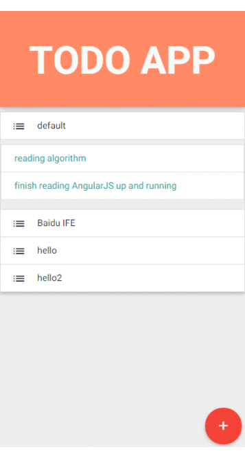

#TODO APP

## App preview

## Requirement

1. Node.js & NPM, latest version
2. Bower, latest version

## Dependencies

1. AngularJS
2. materialize CSS
3. Angular UI router

## Install

Firstly, Install Node.js and NPM.

> https://nodejs.org/

Then, using NPM to install bower globally, using the following commands:

    npm install -g bower

Lastly, Locate to the directory of task 4, which is `task/task0004/work/wwsun/`,
running the following commands in the terminal window, which is used to install relevant dependencies. 

    bower install